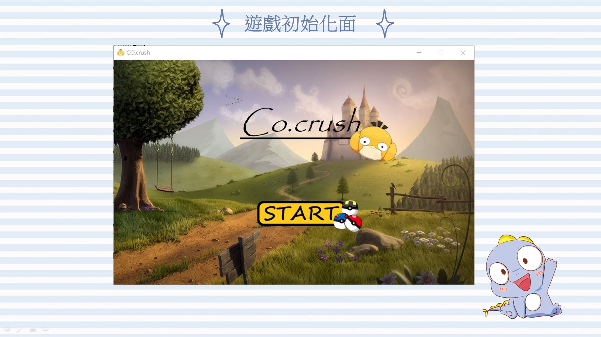
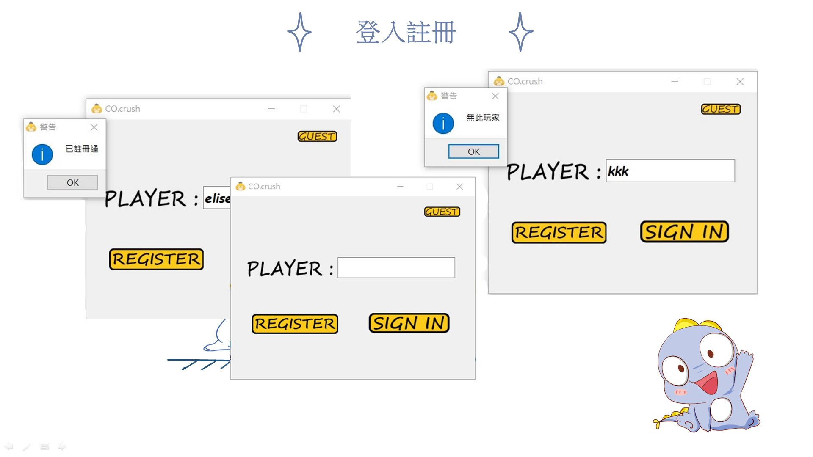
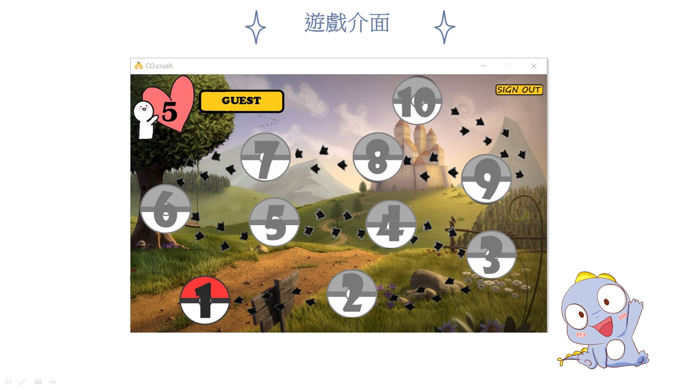
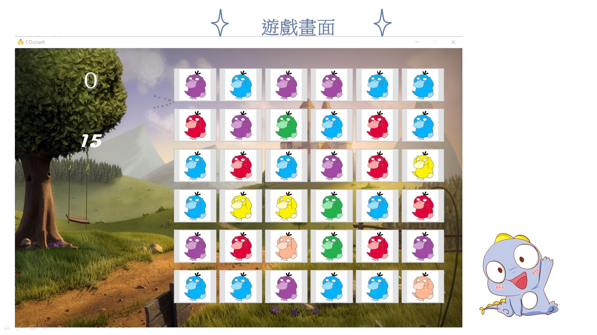
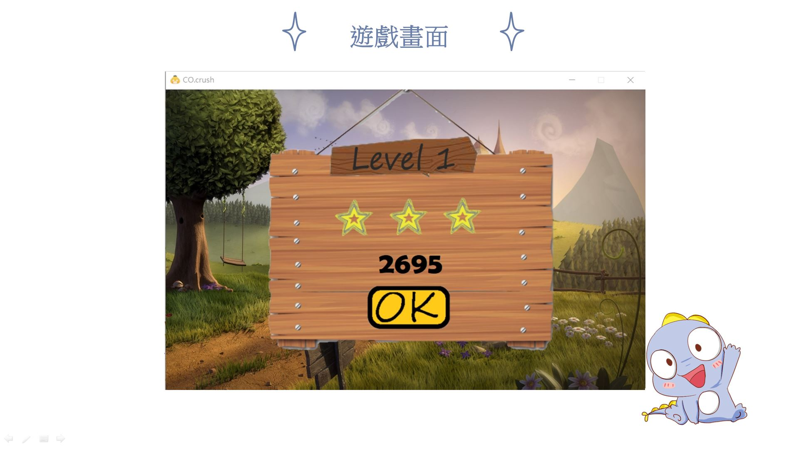

# CodaCrush
### 大一物件導向程式設計小組期末專題

日期 : 2019/06/18

小組成員4位 ( 貢獻度% ) - 分工事項
1. 1072911 陳元娣 (25%) - 介面設計、頁面編排、美術設計
2. 1072919 廖亭柔 (35%) - 主程式設計、遊戲消除的動作規則、註冊/登入
3. 1072928 江毓晴 (30%) - 多個畫面切換、倒數計時功能、I/O讀寫檔案資料、生命值回復
4. 1072945 黎  臻 (10%) - 美術設計

